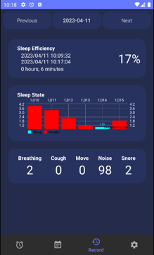
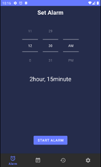
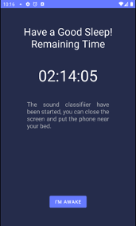
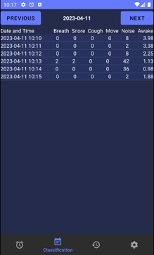
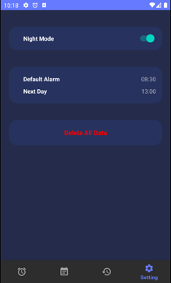
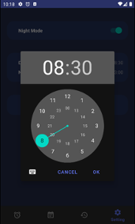
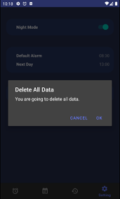

# Sleep Quality App
> This is a final year project in 2022.

## A Android Application that record your sleep quality based on Audio Classification and PSQI!!

The aims of this project is to develop an Android mobile application enabling users to track their sleep quality without the need for wearable devices.

## Features
- **Using audio classification model YAMNet to classify environment noise**
- **Using Pittsburgh Sleep Quality Index (PSQI) to calculate sleep quality**
- **Calculate Sleep Quality, Sleep Efficiency, Sleep Duration, Sleep Distribution**
- **Smart Alarm**

For more detail, please visit the [documentation](https://drive.google.com/drive/folders/1jFwSInc1IAFONRXWufA-ot2SjBdRWvKB?usp=sharing)

## Screenshot

## Installation
1. Code > Download Zip
2. Unzip the folder
3. Open folder `main` with Android Studio
4. Run app on emulator

## Documentation
For all technical detail like formula, class, and model. You can visit the [full document](https://drive.google.com/drive/folders/1jFwSInc1IAFONRXWufA-ot2SjBdRWvKB?usp=sharing)

## Credits
This project's audio classification was mostly from TensorFlow's [YAMNet model](https://www.tensorflow.org/hub/tutorials/yamnet#visualization).